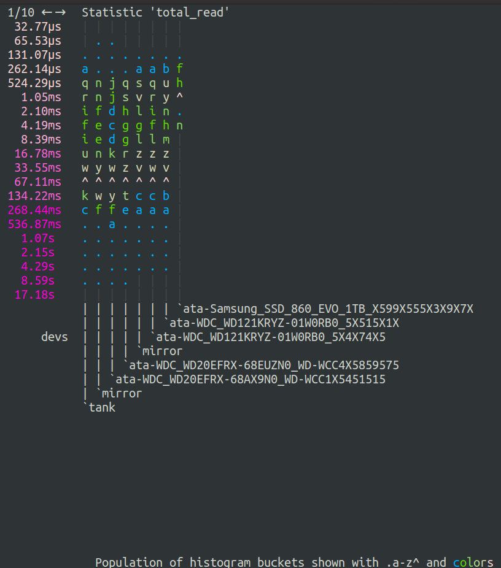
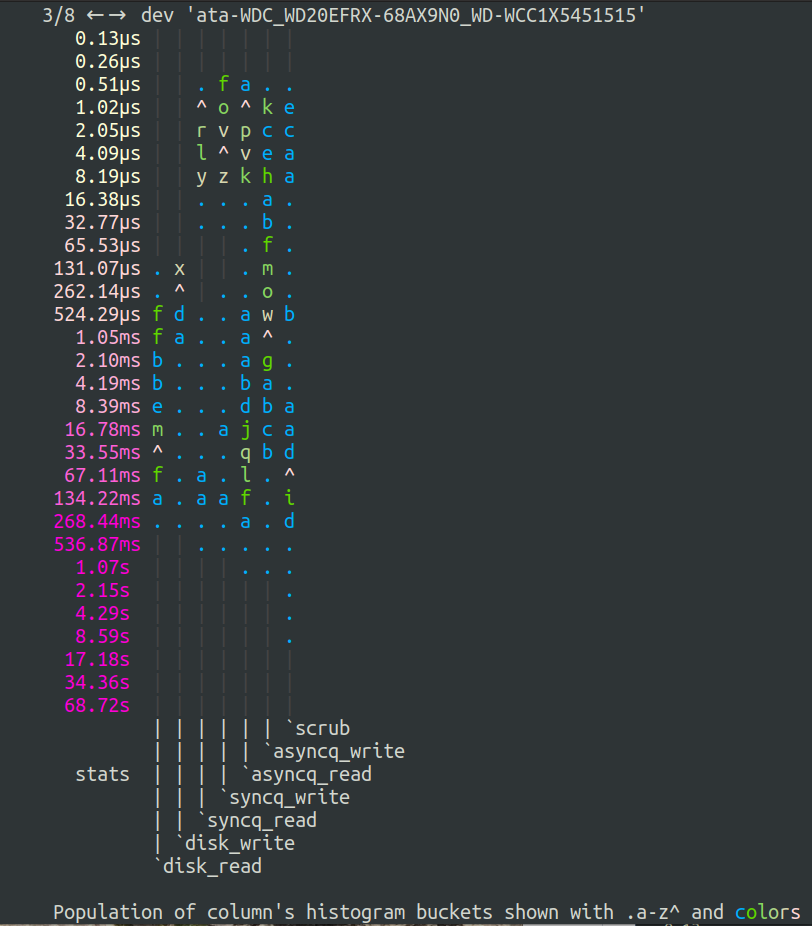

# Getting the gist of zfs statistics

https://user-images.githubusercontent.com/287758/131224903-c7ec43ce-66b1-4caa-bc69-c969468a76d2.mp4

The ZFS command "zpool iostat" provides a histogram listing of how often it takes to do things in parts of your pool. It's useful to find bottlenecks and problem devices, but it's also kind of hard to read, with the nearly 4000 mixed-unit numbers.

(First, what's a histogram? It's an arrangement of data to show how measurements can be different and how often. For instance, last year, 60 times it took Joe 3-to-4 hours to drive to Albequerque, and 20 times it took 4-to-5 hours, 80 times it took 5-to-6 hours, and 2 times it took 6-to-7 hours. That 60-times & 20-times & 80-times & 2-times is a histogram showing population of the buckets of driving-times. It can help you understand the pattern of likelihoods. It seems when Joe has a traffic problem, it's usually pretty big; and problems happen more often than not; but sometimes it's a breeze.)

The exact number of items in a bucket does not matter at all! The gist and relative sizes is what's important, so the numerical output of the "zpool iostat" tool is harder to understand than it needs to be.

The tools here will summarize and display relative sizes of those numbers, side-by-side, to help you see what's important.

# You can help!

There are some opinionated coloring of time herein, and those opinions are not well-informed. If you have a suggestion on how to better slice up the six white-to-red colors of time, please file a ticket. Mention the your (at max) five thresholds to the next color plateau, in nanoseconds.

Also, if the tool crashes, please file a ticket with the output. Include the stack trace.

# Meanings of output

The histogram uses both colors to show relative population, but also glyphs. The glyphs are "." meaning the smallest but nonzero, "a" up through "z", and "^" represents the highest number among the buckets. The glyphs represent linear-growing, equidistant-apart number ranges.  "d" is 4 times farther away from "." than "a" is from ".".

# Usage and prerequisites

To run, have Python 3.4 or greater, and run it with the pool name(s) as parameter.

`$ zpool-iostat-viz`

`$ zpool-iostat-viz tank`

`$ zpool-iostat-viz tank1 tank2 tank3`

It displays data points in the histogram as letters of the alphabet, scaled and colored to show hot-ness of that bucket. It's scaled so that each column has a most-filled "^", and the rest of the letters show relative population vs the most populous bucket.

Press arrows to move stats, and press `q` to quit.
